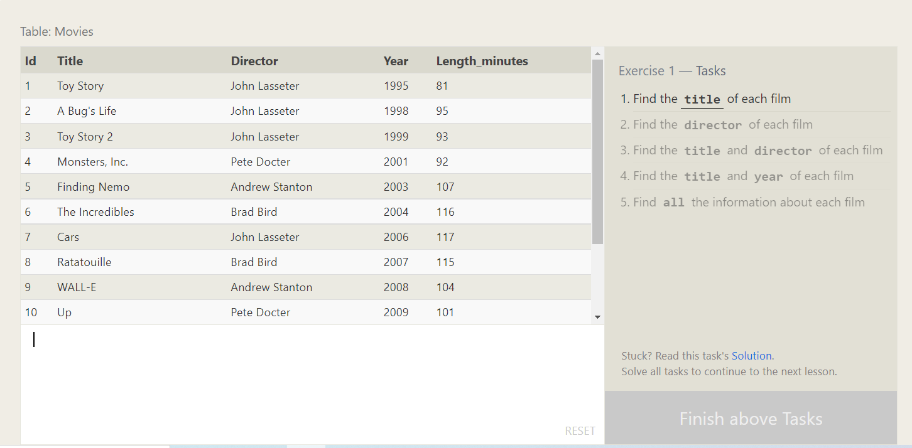
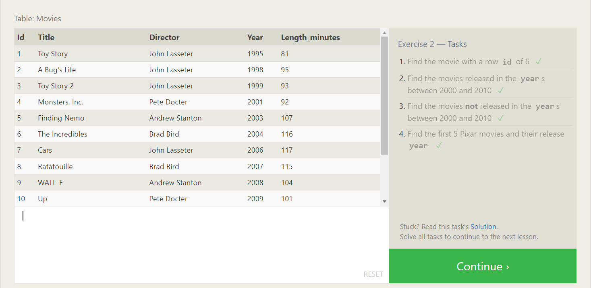
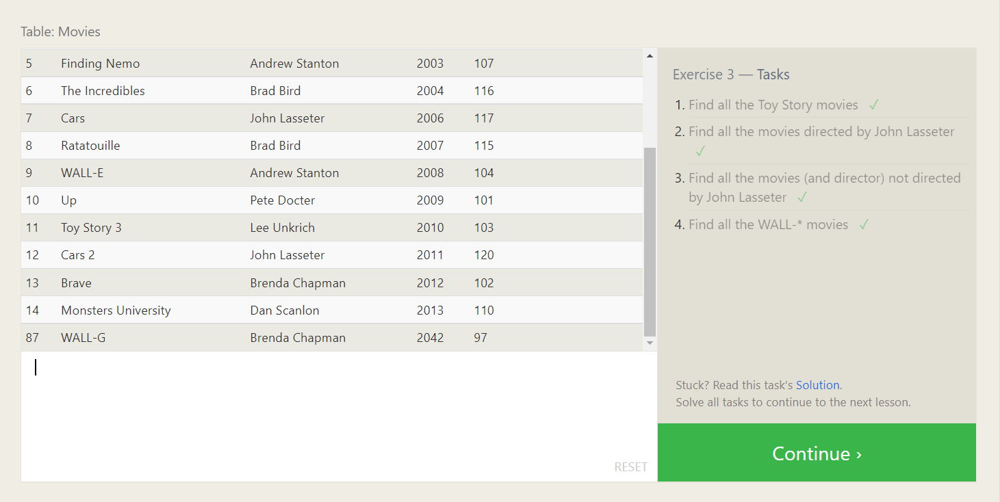
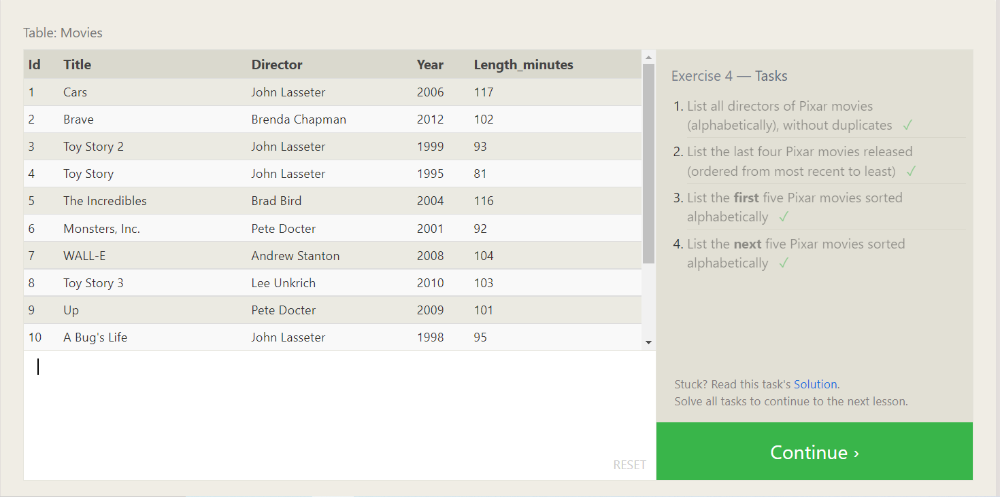
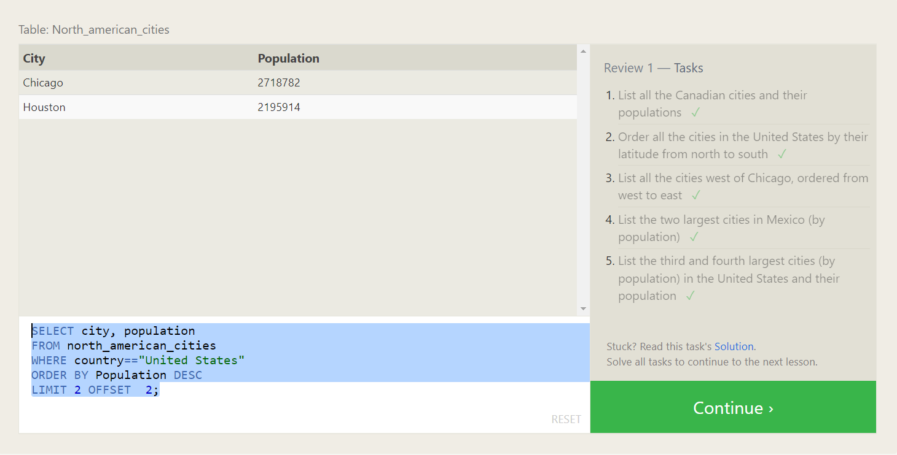
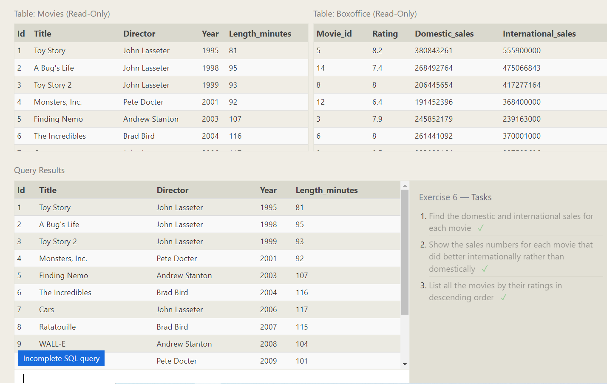

## Screens with notes:

- ## SQL Lesson 1: SELECT queries 101
>> 
>>> - select all table: Select * from table name.
>>> - select one row from table: Select rowName from table name
>>> - select more one row from  table: Select name1,name2 from table name

* ## SQL Lesson 2: Queries with constraints (Pt. 1)
>> 
>>> - SELECT title  FROM movies WHERE id=6;
>>> - SELECT Title FROM movies where year between 2000 and 2010 ;
>>> - SELECT Title FROM movies where year not between 2000 and 2010 ;
>>> - SELECT Title,year FROM movies where id IN (1,2,3,4,5) ;
>>> - SELECT Title,year FROM movies where id not IN (1,2,3,4,5) ;

- ## SQL Lesson 3: Queries with constraints (Pt. 2)
>> 
>>> - SELECT title FROM movies where title like "%toy story%";
>>> - SELECT title FROM movies where director like "%john lasseter%";
>>> - SELECT title FROM movies where director not like "%john lasseter%";
>>> - SELECT title FROM movies where title like "%wall-%";

- ## SQL Lesson 4: Filtering and sorting Query results
>> 
>>> - SELECT DISTINCT director FROM movies
ORDER BY director ASC; -ASC:means(lower to bigger) a,b,c,d,e,... and DESC (bigger to lower)mean the opposite of ASC
>>> - SELECT DISTINCT title,year FROM movies
ORDER BY year DESC
limit 4;
>>> - SELECT DISTINCT title FROM movies
ORDER BY title ASC
limit 5;
>>> - SELECT DISTINCT title FROM movies
ORDER BY title ASC
limit 5 OFFSET 5;

- ## SQL Review: Simple SELECT Queries
>> 
>>> - SELECT CITY,population FROM north_american_cities WHERE country like "%canada%";
>>> - SELECT DISTINCT City,latitude
FROM north_american_cities
WHERE Country=="United States"
ORDER BY  latitude  DESC;
>>> - SELECT city, longitude FROM north_american_cities
WHERE longitude < -87.629798
ORDER BY longitude ASC;
>>> - SELECT city, population
FROM north_american_cities
WHERE country like "%Mexico%"
ORDER BY Population DESC
LIMIT 2;
>>> - SELECT city, population
FROM north_american_cities
WHERE country=="United States"
ORDER BY Population DESC
LIMIT 2 OFFSET  2;

- ## SQL Lesson 6: Multi-table queries with JOINs
>> 
>>> - SELECT title,Domestic_sales,International_sales
FROM Movies 
JOIN Boxoffice  
    ON Movies.id =Boxoffice.Movie_id;
>>> - SELECT title, domestic_sales, international_sales 
FROM movies
  JOIN boxoffice
    ON movies.id = boxoffice.movie_id
    where International_sales> Domestic_sales;
>>> - SELECT title 
FROM movies
  JOIN boxoffice
    ON movies.id = boxoffice.movie_id
    ORDER BY Rating DESC;

<!-- - ## 
>> 
>>> - 
>>> - 
>>> -
>>> - -->

<!-- - ## 
>> 
>>> - 
>>> - 
>>> -
>>> - -->

