## Screens with notes:

- ## SQL Lesson 1: SELECT queries 101
>> 
>>> - select all table: Select * from table name.
>>> - select one row from table: Select rowName from table name
>>> - select more one row from  table: Select name1,name2 from table name

* ## SQL Lesson 2: Queries with constraints (Pt. 1)
>> 
>>> - SELECT title  FROM movies WHERE id=6;
>>> - SELECT Title FROM movies where year between 2000 and 2010 ;
>>> - SELECT Title FROM movies where year not between 2000 and 2010 ;
>>> - SELECT Title,year FROM movies where id IN (1,2,3,4,5) ;
>>> - SELECT Title,year FROM movies where id not IN (1,2,3,4,5) ;

- ## SQL Lesson 3: Queries with constraints (Pt. 2)
>> 
>>> - SELECT title FROM movies where title like "%toy story%";
>>> - SELECT title FROM movies where director like "%john lasseter%";
>>> - SELECT title FROM movies where director not like "%john lasseter%";
>>> - SELECT title FROM movies where title like "%wall-%";

- ## SQL Lesson 4: Filtering and sorting Query results
>> 
>>> - SELECT DISTINCT director FROM movies
ORDER BY director ASC; -ASC:means(lower to bigger) a,b,c,d,e,... and DESC (bigger to lower)mean the opposite of ASC
>>> - SELECT DISTINCT title,year FROM movies
ORDER BY year DESC
limit 4;
>>> - SELECT DISTINCT title FROM movies
ORDER BY title ASC
limit 5;
>>> - SELECT DISTINCT title FROM movies
ORDER BY title ASC
limit 5 OFFSET 5;

- ## SQL Review: Simple SELECT Queries
>> 
>>> - SELECT CITY,population FROM north_american_cities WHERE country like "%canada%";
>>> - SELECT DISTINCT City,latitude
FROM north_american_cities
WHERE Country=="United States"
ORDER BY  latitude  DESC;
>>> - SELECT city, longitude FROM north_american_cities
WHERE longitude < -87.629798
ORDER BY longitude ASC;
>>> - SELECT city, population
FROM north_american_cities
WHERE country like "%Mexico%"
ORDER BY Population DESC
LIMIT 2;
>>> - SELECT city, population
FROM north_american_cities
WHERE country=="United States"
ORDER BY Population DESC
LIMIT 2 OFFSET  2;

- ## SQL Lesson 6: Multi-table queries with JOINs
>> 
>>> - SELECT title,Domestic_sales,International_sales
FROM Movies 
JOIN Boxoffice  
    ON Movies.id =Boxoffice.Movie_id;
>>> - SELECT title, domestic_sales, international_sales 
FROM movies
  JOIN boxoffice
    ON movies.id = boxoffice.movie_id
    where International_sales> Domestic_sales;
>>> - SELECT title 
FROM movies
  JOIN boxoffice
    ON movies.id = boxoffice.movie_id
    ORDER BY Rating DESC;

- ## SQL Lesson 7: OUTER JOINs
>> 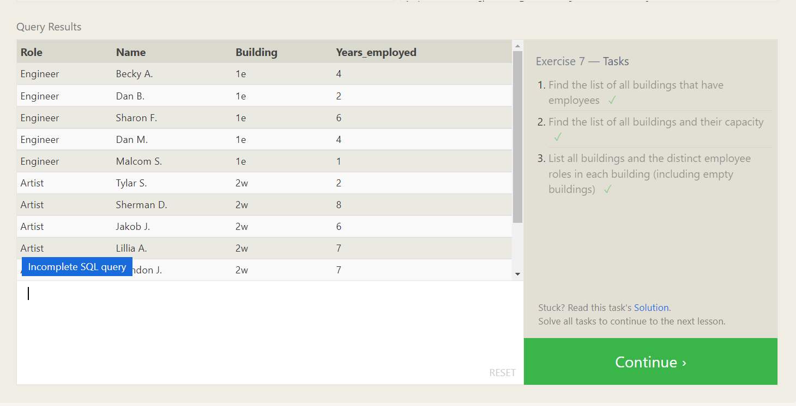
>>> - SELECT DISTINCT building FROM employees;
>>> - select Building_name,Capacity from Buildings 
>>> -SELECT DISTINCT building_name, role 
FROM buildings 
  LEFT JOIN employees
    ON building_name = building;

- ## SQL Lesson 8: A short note on NULLs
>> 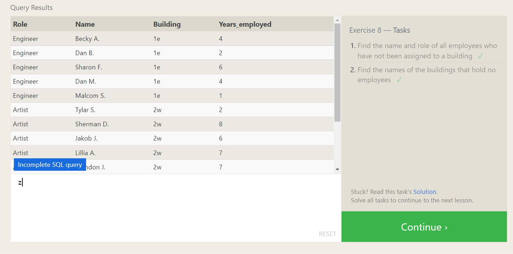
>>> - SELECT Name,Role
FROM employees
WHERE Building IS NOT NULL;
>>> - SELECT DISTINCT building_name
FROM buildings 
  LEFT JOIN employees
    ON building_name = building
WHERE role IS NULL;

- ## SQL Lesson 9: Queries with expressions
>> 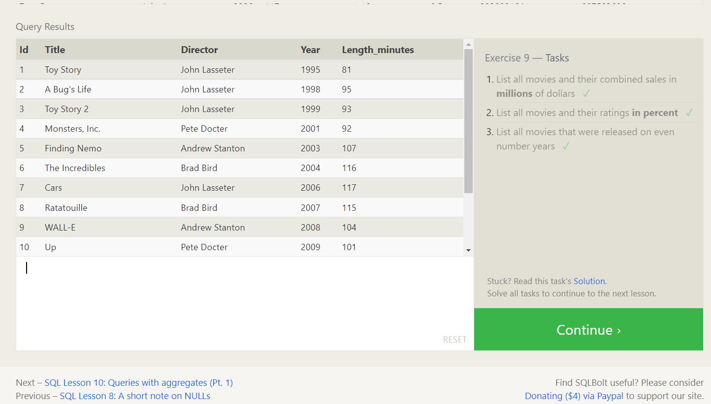
>>> - SELECT Title ,(Domestic_sales+International_sales)/1000000 AS
International_sales
FROM Movies 
JOIN Boxoffice 
ON movies.id=Boxoffice.movies_id;
>>> - SELECT title, rating * 10 AS rating_percent
FROM movies
  JOIN boxoffice
    ON movies.id = boxoffice.movie_id;
>>> - SELECT title, year
FROM movies
WHERE year % 2 = 0;

- ## SQL Lesson 10: Queries with aggregates (Pt. 1)
>> 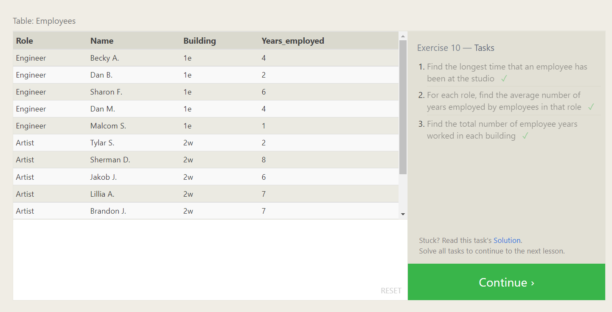
>>> - SELECT MAX(years_employed) as Max_years_employed
FROM employees;
>>> - SELECT role, AVG(years_employed) as Average_years_employed
FROM employees
GROUP BY role;
>>> - SELECT building, SUM(years_employed) as Total_years_employed
FROM employees
GROUP BY building;

- ## SQL Lesson 11: Queries with aggregates (Pt. 2)
>> 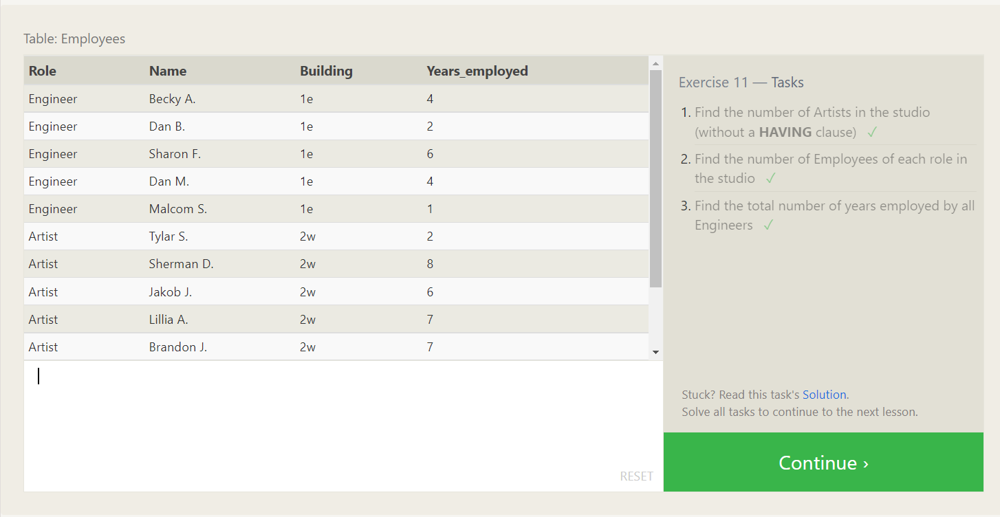
>>> - SELECT role, COUNT(*) as Number_of_artists
FROM employees
WHERE role = "Artist";
>>> - SELECT role, COUNT(*)
FROM employees
GROUP BY role;
>>> - SELECT role, SUM(years_employed)
FROM employees
GROUP BY role
HAVING role = "Engineer";

- ## SQL Lesson 12: Order of execution of a Query
>> 
>>> - SELECT director, COUNT(id) as Num_movies_directed
FROM movies
GROUP BY director;
>>> - SELECT director, SUM(domestic_sales + international_sales) as Cumulative_sales_from_all_movies
FROM movies
    INNER JOIN boxoffice
        ON movies.id = boxoffice.movie_id
GROUP BY director;

- ## SQL Lesson 13: Inserting rows
>> 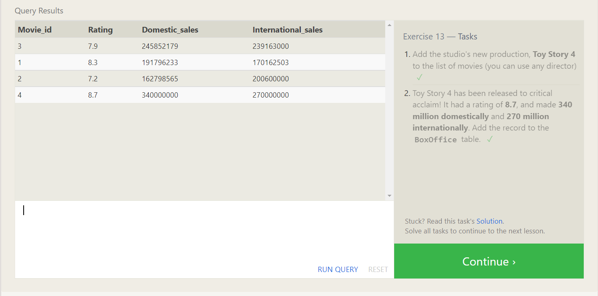
>>> - INSERT INTO movies VALUES (4, "Toy Story 4", "El Directore", 2015, 90);
>>> - INSERT INTO boxoffice VALUES (4, 8.7, 340000000, 270000000);

- ## SQL Lesson 14: Updating rows
>> 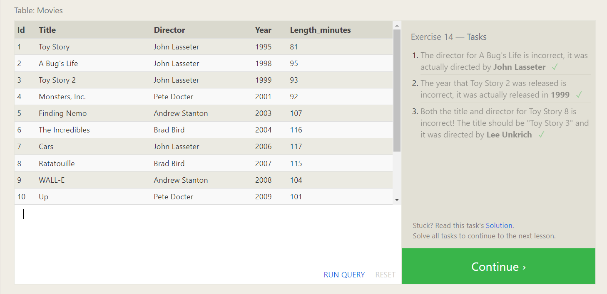
>>> - UPDATE movies
SET director = "John Lasseter"
WHERE id = 2;
>>> - UPDATE movies
SET year = 1999
WHERE id = 3;
>>> - UPDATE movies
SET title = "Toy Story 3", director = "Lee Unkrich"
WHERE id = 11;

- ## SQL Lesson 15: Deleting rows
>> 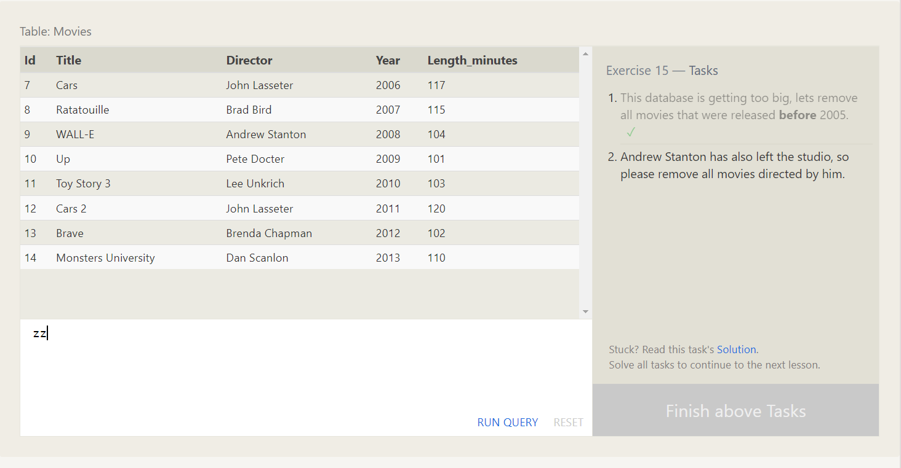
>>> - DELETE FROM movies
where year < 2005;
>>> - DELETE FROM movies
where director = "Andrew Stanton";

- ## SQL Lesson 16: Creating tables
>> 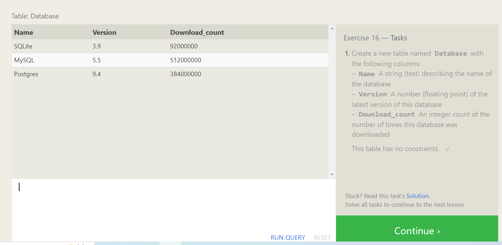
>>> - CREATE TABLE Database (
    Name TEXT,
    Version FLOAT,
    Download_count INTEGER
);

- ## SQL Lesson 17: Altering tables
>> 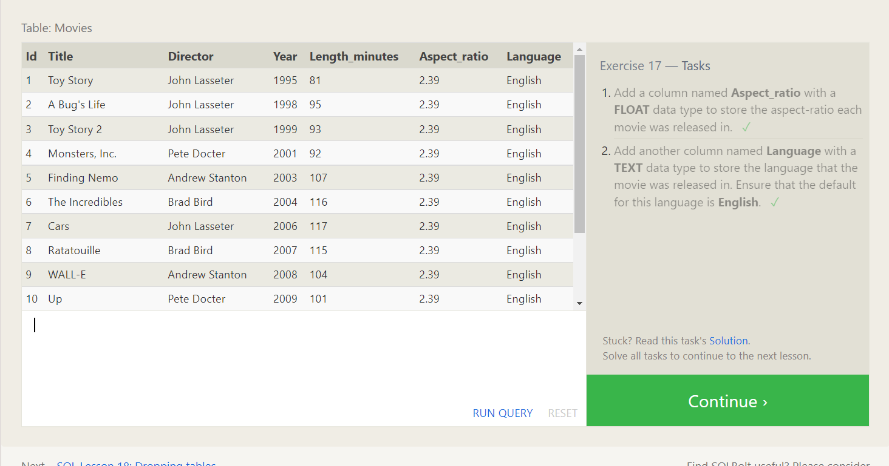
>>> - ALTER TABLE Movies
  ADD COLUMN Aspect_ratio FLOAT DEFAULT 2.39;
>>> - ALTER TABLE Movies
  ADD COLUMN Language TEXT DEFAULT "English";

- ## SQL Lesson 18: Dropping tables
>> 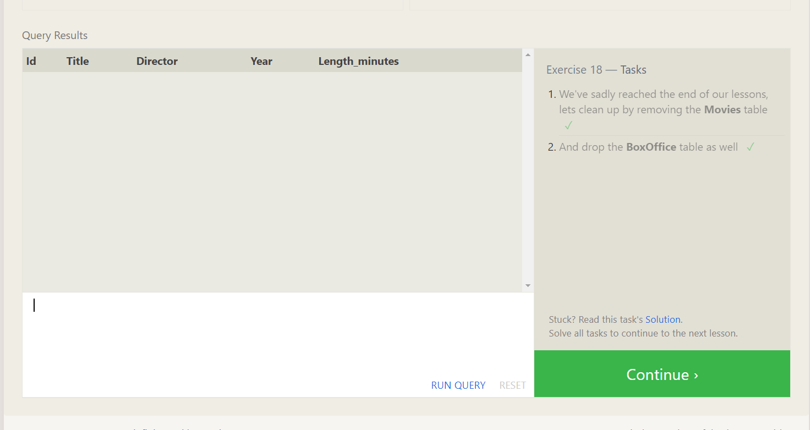
>>> - DROP TABLE Movies;
>>> - DROP TABLE BoxOffice;

